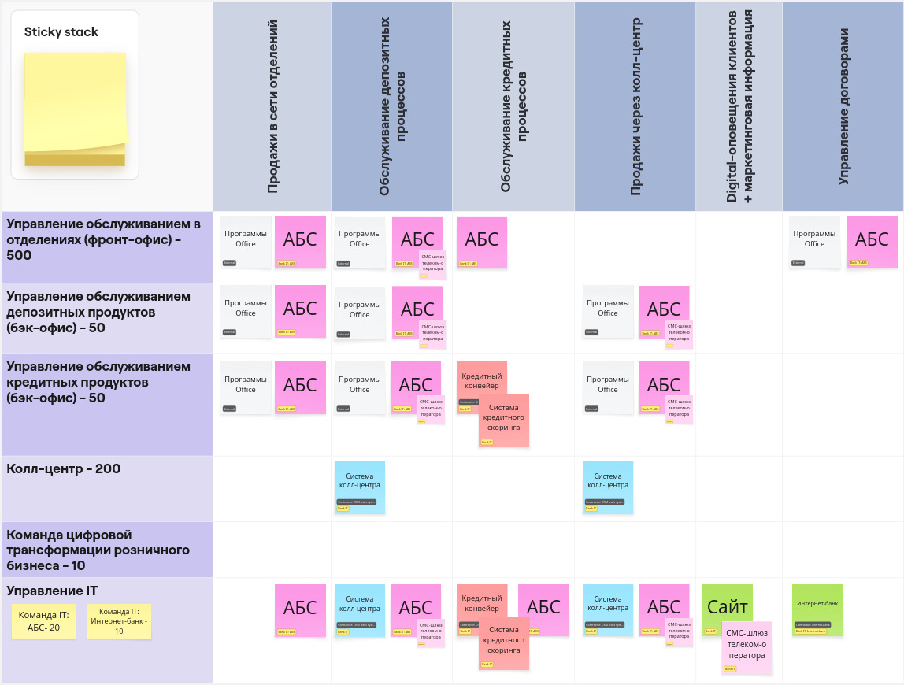
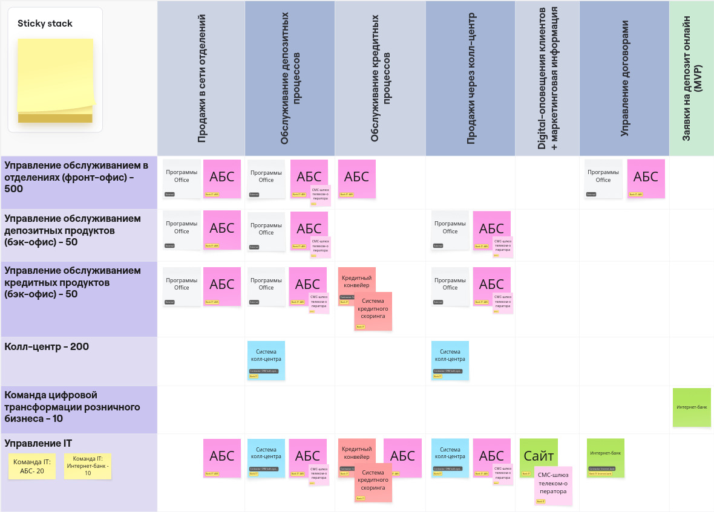
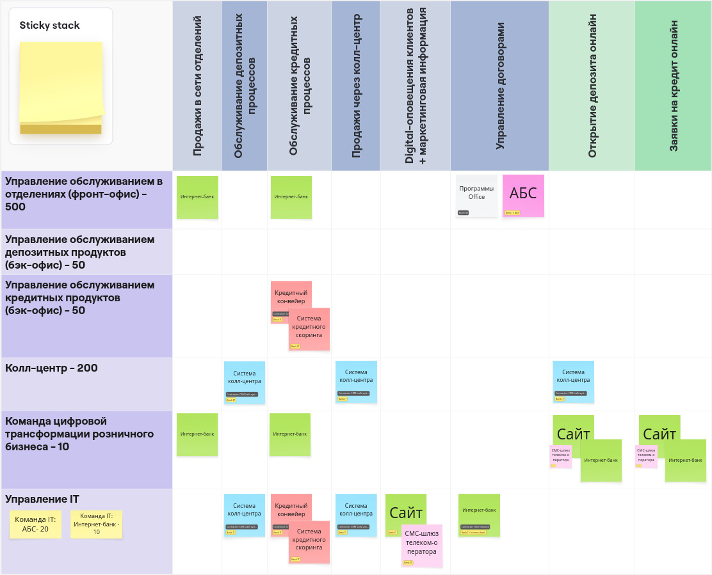
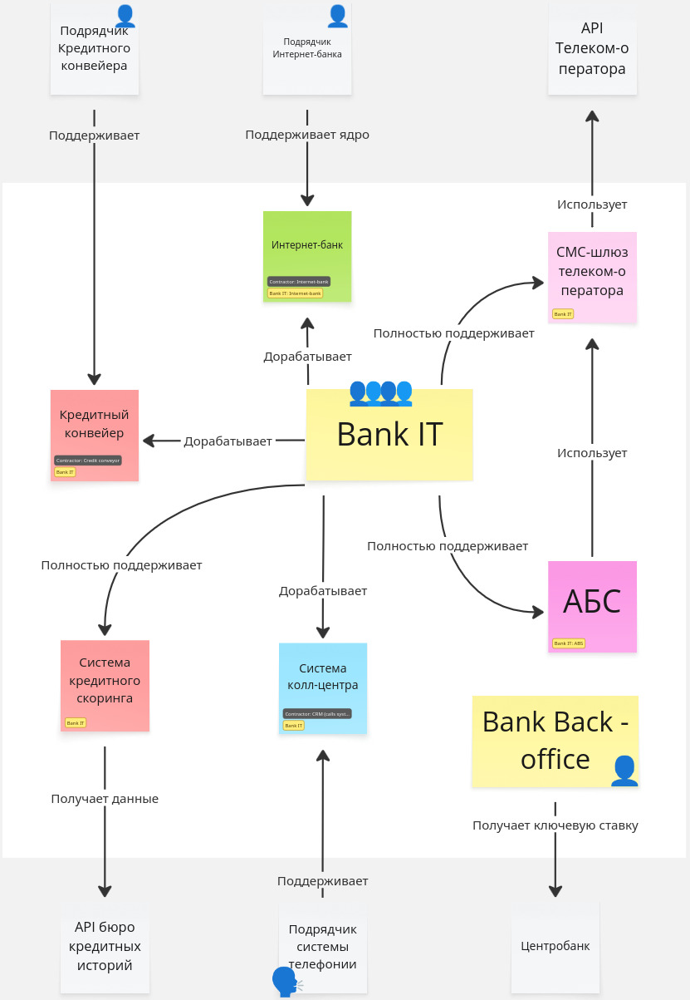
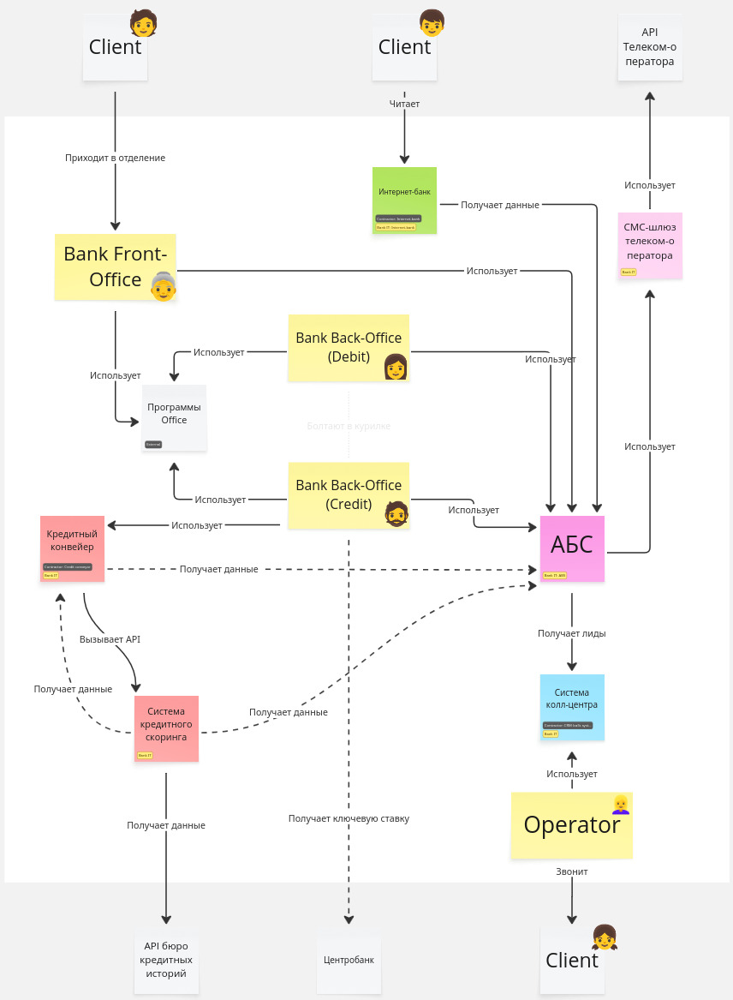
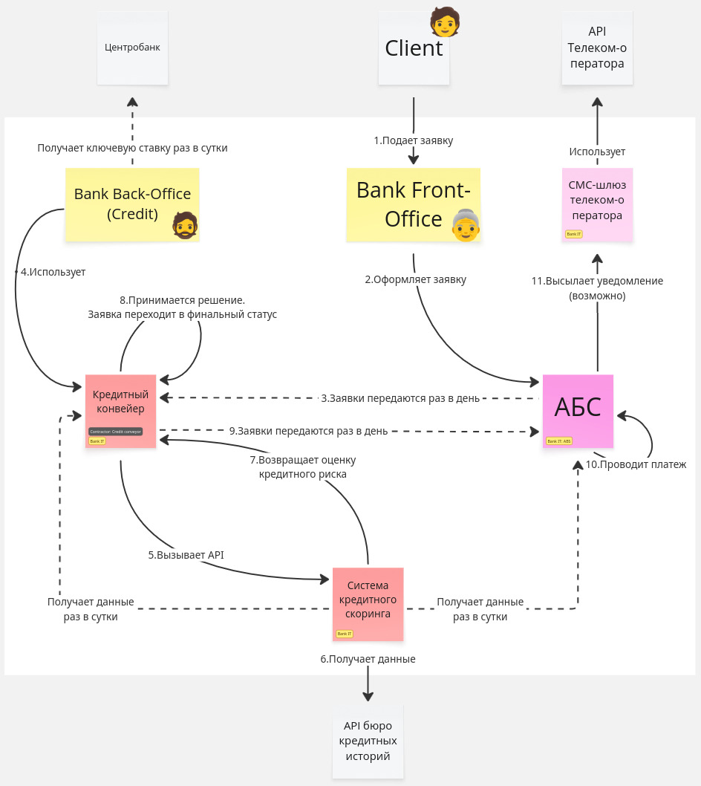

# Цифровая трансформация банка "Стандарт"

## Задание 1. Карта IT-ландшафта и схема интеграции приложений

_У вас есть Business Capabilty Map, а также описание организационной структуры предприятия и процессов. На основе этих данных создайте в draw.io:
Карту текущего IT-ландшафта. В строках она должна содержать элементы организационной структуры, а в колонках — бизнес-возможности второго уровня. Например, в строке стоит кол-центр, а в колонке — продажи через кол-центр.
Схему интеграции приложений с указанием участников процессов.
Дополните карту ландшафта и схему интеграции описанием кредитного процесса._

### Карта исходного IT-Ландшафта

### Карта целевого IT-Ландшафта (MVP)

### Карта целевого IT-Ландшафта

### Схема технической коммуникации с внешними системами

### Интеграция приложений внутри контура

### Процесс оформления кредита

## Задание 2. FURPS+ таблица
_Команда трансформации просит вас обобщить весь набор требований в формате FURPS+ таблицы:
Выделите архитектурно-значимые требования. В ходе работы учитывайте не только контекст из задания, но и информацию о системах компании из блока «IT-ландшафт компании».
По возможности добавьте дополнительные требования, которые кажутся вам важными и могут повлиять на решение. Напишите обоснование для таких требований в поле «Комментарий»._

**Архитектурно значимые требования** - требование, которое может повлиять на структуру компонентов системы и выбор стека разработки для новых задач.

[FURPS+](task_2/FURPS+.md)

