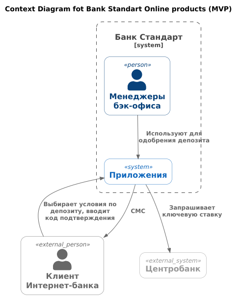
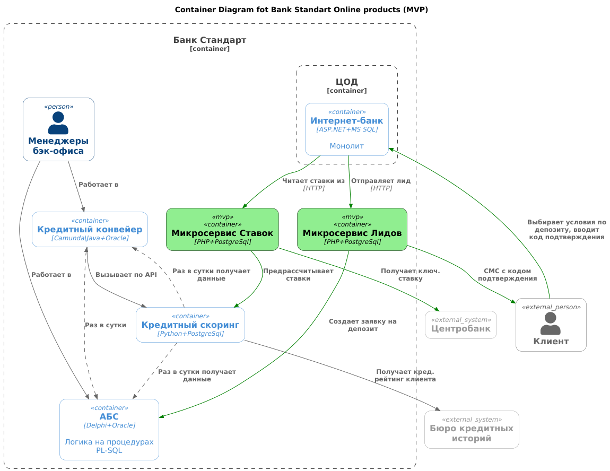

### **Название задачи:** 
Банк "Стандарт" - Оформление заявки на депозит через Интернет-банк (MVP)
### **Автор:**
### **Дата:**
### **Функциональные требования**

**Лид** - не подтвержденная заявка с сайта или из Интернет-банка.

| **№** | **Действующие лица или системы**   | **Use Case**                                                    | **Описание**                                                                                                                                                                                                                                                                                                                                                                                                                                                                                                                                                                                                            |
|:-----:|:-----------------------------------|:----------------------------------------------------------------|:------------------------------------------------------------------------------------------------------------------------------------------------------------------------------------------------------------------------------------------------------------------------------------------------------------------------------------------------------------------------------------------------------------------------------------------------------------------------------------------------------------------------------------------------------------------------------------------------------------------------|
|  UC1  | Пользователь, микросервис Лидов    | Оформление заявки в Интернет-банке.                             | 1. В интернет-банке клиент видит список доступных депозитов с персонал. ставками. 2. Клиент выбирает вариант депозита и сумму, и отправляет заявку в систему. 3. Система посылает пользователю смс с кодом подтверждения, в Интернет банке отображается поле ввода. 4. В основном сценарии пользователь получает код, успешно вводит его в форме, заявка поступает в основную систему для дальнейшей обработки. 5. В альтернативных неудачных сценариях пользователь может запросить в кабинете повторную отправку кода, либо позвонить по указанному телефону в колл-центр банка для решения проблемы. |
|  UC5  | Пользователь, микросервис Ставок   | Клиент видит в интернет-банке персональные ставки по депозитам. | Ставки предрассчитываются раз в день автоматически. 1. Получить актуальную на день ключевую ставку ЦБ. 2. Обратиться к сервису Скоринга. 3. Сохранить персональные ставки по депозитам на день.                                                                                                                                                                                                                                                                                                                                                                                                             |

### **Нефункциональные требования**

| **№** | **Требование**                                                                                                                                                                        |
|:-----:|:--------------------------------------------------------------------------------------------------------------------------------------------------------------------------------------|
|  1.   | Данные необходимо защищать с помощью механизма шифрования трафика.                                                                                                                    |     
|  2.   | Нужно использовать технологии, совместимые с текущими в банке (PHP\Python+PostgreSql+Flask).                                                                                          |    
|  3.   | В новом процессе лучше избежать прямой работы интернет-банка с API АБС.                                                                                                               | 
|  4.   | Команда АБС утверждает, что база данных системы уже перегружена.                                                                                                                      |        
|  5.   | Система кредитного скоринга очень важна для работы банка и испытывает повышенную нагрузку в рабочие часы, её не нужно нагружать дополнительными процессами по предрасчетам скорингов. |    
|  6.   | Лучше предусмотреть равномерное горизонтальное масштабирование и распределение запросов между серверами, приложениями и ЦОД.                                                          | 
|  7.   | Отклик интерфейса по операциям пользователя - в пределах 10 мс.                                                                                                                       | 
|  8.   | Дизайн должен соответствовать бренду.                                                                                                                                                 | 
|  9.   | Необходимо разработать документацию для дальнейшего расширения системы.                                                                                                               | 

### **Решение**

В рамках реализации MVP предлагается следующее:

| **Решение**                                                                                                         | **Обоснование**                                                                                                                                                                                                                                          |
|---------------------------------------------------------------------------------------------------------------------|----------------------------------------------------------------------------------------------------------------------------------------------------------------------------------------------------------------------------------------------------------|
| Микросервис Ставок.                                                                                                 | Необходимо автоматизировать расчет и хранение ставок.                                                                                                                                                                                                    |
| Микросервис Лидов.                                                                                                  | Слой обработки обращений клиентов через онлайн-каналы. На этапе MVP реализуем там подтверждение смс-кодом.                                                                                                                                               |
| Провести ресерч системы Колл-центра на предмет коробочного решения для обратного звонка (прозвон заявок с сайта)    | Поскольку у нас есть требование подачи заявок с сайта, понадобится функционал Обратного звонка. Надо бы заранее изучить варианты.                                                                                                                    |
| Доработать текущий Интернет-банк:  1) список депозитов с персональными ставками 2) подтверждение смс-кодом  | Добавить интеграцию с новыми микросервисами.                                                                                                                                                                                                             |
| Сосредеточить усилия на масштабировании системы Скоринга.                                                           | 1. Это одна из важнейших систем в инфраструктуре и в ней уже заложена возможность масштабирования. 2. Система Скоринга полностью поддерживается IT Банка. Необходимо выполнить нагрузочное тестирование с целью расчета кредитного риска "на лету". |
| Заявки на депозит из Интернет-банка на данном этапе сохранять в АБС. Дальнейшая обработка в рамках MVP не меняется. | Рефакторинг заявок не выглядит первоочередной задачей, так как MVP предполагает сохранение полуавтоматизированного процесса их обработки.                                                                                                                |
| Начать продуктовую и архитектурную проработку продукта "Платформа сопровождения клиента".                           | Нужна масштабируемая система, предоставляющая информацию о клиентах, ставках, движении заявок и тд с разными уровнями доступа для сотрудников банка.                                                                                                  |                                                                                                                    |                                                                                                                                                                                                                                                                                                       |
| Начать архитектурную проработку механизма поставки данных (платежей) в Скоринг по мере их фиксации в АБС.           | Сейчас данные из АБС поступают в Скоринг раз в сутки, что приведет к массовому предрасчету персональных ставок.                                                                                                                                          |                                                                                                                    |                                                                                                                                                                                                                                                                                                       |
|                                                                                                                     |                                                                                                                                                                                                                                                          |

[MVP_diagram_context](https://www.plantuml.com/plantuml/uml/RL9BQzj04BxhLsnygGonHI6dGW-Dupx0YKtiDEGarhAIYEh5QaKJIY6s2osaRMWl3QLGVEdP4RPZREByXTb_r1b9Dgcf3jBkw7lDx6xiLG_DofRPR1tLgayVQnkERxbnnuw5oqwb3ACdXY7us_A98q_ZTXpPmWfyQVkoR0MU4RhSbx7dbYBPSPssKTagDQXqi5ipF1v9Ms39h13ZJ9P3H6hQezgpe_f1ownLdxVC_LSlNhRqefRNMlM6kLC_tCEA9XtfsYpdiXs7dmZkiUD0ictkls5DoVqE5vBLVTVnRHQAe1DRCcBwxki6qXksY0BVh9v9tN8T3Bp92l0JvZ25CTof7eDh-i1ONS0Tldibk84XBcSmB22sKDIQvzY1bqcqJN5C2dyoDf8MItoENiAtWvY2dUjjZ4cKRncCmG3jQ3c2eRfGlKAHlTCOFXbHvs7eEXQNJk17nFkD9bCCl809cS9KNULMHChwquFG5bm68cNyId5ZD9XGN-gImOtw0hCIBDG7v7TNhP72lkq-fA_RNoFy7itdwZFSghxwIZCRuVQAONL4_MF0F1Zz6QVmMznYc-ZnNjF8OZdzTVtlwX8dE4MD8OsVeKKtxJR9155iJLNrDnd-JLBxASMPqJA5mWXTa_Gq9odhuRmenh_sg_FyWUxtb45zmc4dUHOKdcF37r4deTQPwgPdby1CzVylkBfZ0po60Ts7lm00)

[MVP_diagram_container](https://www.plantuml.com/plantuml/uml/hLLRJnj767tthvXOaMeBCAgKfqWyW752AeEtjbCKgT9gl1xi5UjTTtTCWwf8NDBo43MqLH-gfahAI_iAZXqCrFGlpFwZdczsxVfAMwaWsxipyvrplklSsyfjcza7PgdyB9zR-JXnptOjfrKLBTzXTIcRmSFbPPz_cQdPijwgj0BXMvuhXIipbjTORZhSbQs6inJ8gcDNbhCFbWnQUhgPNsxmG0eVIsOM5jnsXPzfucmYyL5-zLdXQTdCvnwLpUAJnnlbL3eHhvKBXhbUsDx2IcArMiqveW6oCg-baeszPdAHtQ_KifxZ-Il9YiEjNLhP0NwyvjYrkdpi2-4cqsHV58wsvS6-Qz5PAPx7P--l5ek5RVDHOQjiPWlvGX6x3bIExOvkbEI-8rRMUL0NrJpUK-an2iWpVU4ans2IjLXBGjhI4MmO2hPkyvhF6sp7asoDkxki9BbRvRva1PViMTFtgYrB1Yor-Pa104FuWUUQkUSoPJasWhB8akfdTQDwgglwuH68ao0gxIFiZUYOBwgsD2ijN_0MdVu-V1qUg5kchl7JLHtL2uzW-Yhyck7n42-tsEYfgmcSYkdlaFrl4HDXg0jrhlhgcbmREcMkUItoOJzLWKUQCJh5r1d0wR6ZpiC3Y4sphsRPLRda9ZotJ0iU2ZzYVQj-r0OCVqEZb4q7N047OxAVI9pgGbuVtqTBGutON2qPcQrSUM6pn4gVvcb5_G8l-lZSK1ZWnui9V5u9wDXtSEAC3DQ5qwpR2mMVMuxG26zW_HxnkbRd353u-fDY4tv3mGsFyNoEq1hv9Q9CJy37sGbqd7KknvEYhf0dBR6DvIloYqYpl46n-lmJliT7j4p11vRdssxjJlpma1XqollgFS4O-xBkkGk65qXKRkaB9yRMu6isQdrITnobNn7gIwRQm8JZHy3jwNRZjM0bxhv88K5CQfkFWOXIXl1wWaqabL45GIqvq9tFC25oEXW_mFuId_O05ZnirNXoXygfXFqFUZLPrDde6MlNz7PsR4j4vTcbEeRz1yfz-8gfY_1RTRs4ZBsaTbNd8uadmMC08p6zWCNHG4vxdi5CzwPC9weiwNCfp8Pj-HwkXZq0nQtLqpFc5Ygf7zkaTp04seYGxabZmnYlj3WuDEWdopdf25uD_ZNJ6ontmDF-PvvXD2RdoMpNVjVz4qL4ZqnoI6U-foxfn4QvR8nnw5lX3fuvdhq5DeqJmhy9JwCKqBJltCKo89aI3vlnWjOaxwAPe2VL8VvFoBkHjXZrK5VR3CeNYOHkkVXIcXhBr6eNm3qOO1uZLpUK72oUHfs7P7Lrwrng0SUBg3PTA7fSHOEm4pLN1uhQEjSVj5MVKEPfqygc0ung7rwXPwYXCqP5eqdm-UDkejaaSwR5tvVlkyd145_26QP_hy2cnp3f65xgwF5qOau-XzVoD39UNuSdcP7qXSV_AJpnz3ZJ6UaCS2zH9QSHMdpVZQLj5iDV)

### **Альтернативы**
Опишите здесь наиболее важные альтернативные решения.

2) В MVP сделать полноценный микросервис Заявок и request flow (с доступом всем заинтересованным сотрудникам).
Плюс: не будет доп нагрузки на АБС.
Минус: нужны большая миграция данных, разработка системы прав и доступов => можем не успеть, есть более приоритетные задачи.

3) Вместо предрасчета персональных ставок можно сделать расчет "на лету", по запросу.
Плюс: не будет избыточных операций.
Минус: возможно, Скоринг не справится. Лучше сначала провести его нагрузочное тестирование\масштабирование.

**Недостатки, ограничения, риски**

| **№** | **Недостатки**                                                                               | **Комментарий**                                                                                                                                                                                                                                                       |
|:-----:|:---------------------------------------------------------------------------------------------|:----------------------------------------------------------------------------------------------------------------------------------------------------------------------------------------------------------------------------------------------------------------------|
|  1.   | Дополнительная нагрузка на API\БД АБС.                                                       | Поток заявок из Интернет-банка пойдет в БД АБС. Вариант минимизации риска: 1) Рассмотреть постепенное включение фичи с оценкой нагрузки на БД АБС 2) параллельно пишем новую платформу сопровождения клиента.                                                 |
|  2.   | К потоку заявок по новому каналу может быть не готова не только БД АБС, но и штат бэк-офиса. | Вероятно, бизнес учитывает данный факт; возможно изначальный поток заявок не будет слишком большим (например, на стадии "MVP в проде" можно не давать рекламу новой функциональности). Или, например, включать функционал Интернет-депозитов в "пилотных" регионах. |
|  3.   | Предрасчет персональных ставок, что создаст доп. нагрузку на систему Скоринга                | Путь минимизации риска: на текущем этапе работаем над масштабированием Скоринга.                                                                                                                                                                                      |

