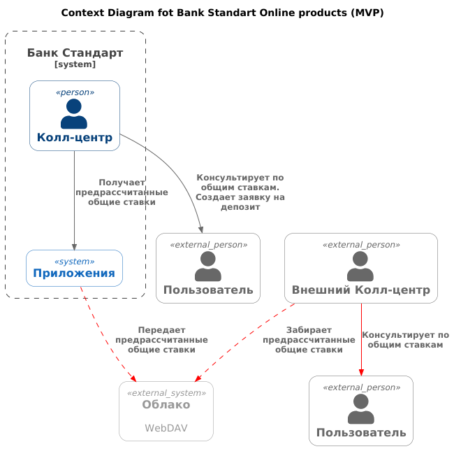
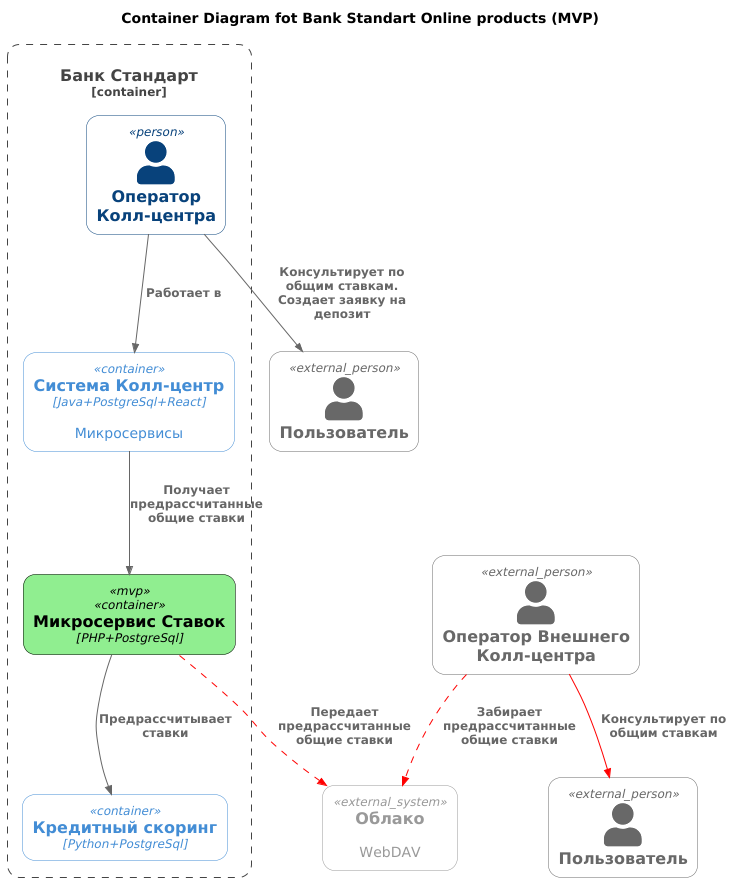

### **Название задачи:** 
Банк "Стандарт" - Оформление заявки на депозит через Интернет-банк (MVP) + Передача ставок в кол-центр
### **Автор:**
### **Дата:**
### **Функциональные требования**

**Лид** - не подтвержденная заявка с сайта или из Интернет-банка.

| **№** | **Действующие лица или системы**            | **Use Case**                        | **Описание**                                                                                                                                                                                                                               |
|:-----:|:--------------------------------------------|:------------------------------------|:-------------------------------------------------------------------------------------------------------------------------------------------------------------------------------------------------------------------------------------------|
|  UC1  | Пользователь, менеджер колл-центра          | Пользователь звонит в Колл-центр.   | 1. Пользователь общается по телефону с менеджером колл-центра. 2. Менеджер сообщает клиенту общие ставки. 3. Если клиент согласен, менеджер заводит заявку в системе. Дальнейшая обработка проходит через менеджеров бэк-офис. |
|  UC1  | Пользователь, менеджер Внешнего колл-центра | Пользователь звонит в Колл-центр. | 1. Пользователь общается по телефону с менеджером колл-центра. 2. Менеджер консультирует клиента по общим ставкам банка.                                                                                                               |

### **Нефункциональные требования**

| **№** | **Требование**                                                                                                                         |
|:-----:|:---------------------------------------------------------------------------------------------------------------------------------------|
|  1.   | Колл-центр партнёра работает во внешней информационной системе относительно банка.                                                     |     
|  2.   | Колл-центр партнёра готов получать актуальные ставки в виде файлов. Нет возможности сделать API-вызовы (например, через SFTP-протокол) |    

### **Решение**

В рамках реализации MVP предлагается следующее:

| **Решение**                                                                                            | **Обоснование**                                                                              |
|--------------------------------------------------------------------------------------------------------|----------------------------------------------------------------------------------------------|
| Доработать приложение Колл-центра:  получать и отображать актуальные общие ставки.                 |                                                                                              |
| Предрассчитанные ставки выгружать в фиде файлов csv в облачное файловое хранилище.                     |                                                                                              |
| Организовать интеграционное тестирование с партнерским Колл-центром.                                   |                                                                                              |
|                                                                                                        |                                                                                              |

Новые связи для отправки ставок показаны красным цветом.

[MVP_diagram_context](https://www.plantuml.com/plantuml/uml/lLHTQzfG6BxFhpWDXKLMbOvU3RomQhU1RKJJIg_2qPnfM4p2oKbRAGEdi6viKBQRmIvMzW-qDDFLwlx2EVzexz5GjLilji4Kyd7UvttUvtbEahMzGjNCRPaLux1Oo6mgQxPRTqABXDH1JSRyu74wJV5ngc6pPbWB0qBhdik8or9rhvNs7UooiEKa0sOvTYsTsqgMvDB-RZ7TmW4Z59RCdEmuOIaVa8hoe9WzrFSDirZOCSpoioTF3IsXn6k6NZBpUdKFLfIiPPM9O-26fkAWxTRL3RGkQNAUuz7CUhPSrglcZhvdc3czg9UXwjWkMQak5ogixP1C7WTDOXNXNaiabaUqZdoJ4iUac950NI5JAR5K4CHivX0Kcq5v6pSeRg7d7aFRs7s1AWox5gOCwQxiHJxrhB3E0gJj7fIWlKHeuBbcuOHfCiRD3QJo2pxbO_6U3-5yoVkYooDv3_DLc7Yduz4VTO16q_C9-F6eRFp89pmIR-0uujyH_onv-3WfNWF1H7H59wQej67RMZEAOrApy95i_i87WExpQpu5M9NKyja3i1HZjxrGEczhDSX1mZy0TCAl4VyA-kJb5IZjYAwQGASAWj-yKSE-xzXrp6pF3MRcH0VKZK7QDwcAZyHvh4espSrfowRkTI7niBLBu5zcpOBiYJCG68akuZzWUCIluDWNh-1_1kFdwYVY7OyGu0VYBUYB45HbvHBo6C6mbugoEkjsVwM-2Q1xSe-WPmGfzE9nVBgWl5ccxFER54G7nQ4CRWuVWgfpMHOz19Bw24gH984Aw8njInch6t_xuFojb1cpVFLm8yZSUKtc0rUJNJmq5y0-Y_HV4xvVmSFvb-5tnXSwFW7HGFhz3pf-0W00)

[MVP_diagram_container](https://www.plantuml.com/plantuml/uml/jLLjQnf14Fv-ls9x1AhaHLBwgP0FYJ5zmKPHav1FntgtqQFhdTrRqqef90QQbXHA-wKGIjFyWyH4OcqqVs7l7tLcDUebfj125TIRdNdccMTcrdkhgGqh-T3A5pRJgOLvuvxhsRpci9hWf2nbDNYKI0ZwQgxaodAjM0kOi7rFCa_EsNubKUNKaxKAdmsamzrY8lbmDekcjUVfH8K6aWamMKc8eAx7n5mLV0tZVdfnCxDMiDAfbOALU_huII4MDmQsGYPhBMSsLi5YB3fEYhCA92lGKioiR5VD6J9LB2Lzxei5iyYf_G8jMu0_i76tL9QF1MEU6SVu7ECwbWPrpqPVoLuFVASMSxdCXhMIMIrOoKmwauDJ3YmZf-C7ULddR66P1cNcfE4v5e-a07gMODoCm9Ybsrm6ZfQWaWKtt0LpmDcGhkIC37KZoouj2LeXMxuaIzHxGVAIUWuLacGyZ2PLuJirMmOazdmz2m1P9WBVirAlPGnxDZz3J7MaUkfN-55Tm7TJdOGDrS9dO612pXiH3_ug0aIr_2g3Ydo1WT_LbMg5Epga5-uGzKLrmV0UFzMPwX5rYD3grspu3YpTi87E0zny7GQded5ViQ93j_k8f-1_eZgg1suRhBYyk0vr3YMoblmQAbAF5K4VZFWCtbtL8UeOIE3FSw2p4pRCE7bZ47Zr-SV-oFiFD15Yc3uMsBvmlP8LQFA8TGY-BKZQ1gnkUA1-ad0NwOEv3MpE42PRbsNVcyxwWOH1oR_a4x5johbbmnemJV8O87TrBoxLoIIA2FACRjCntEaSexR40_KDqdU0H0_eOArD3NTmAwk9ysbLN5luC0_Rhitk3hyMkGbSEhgm9zbeLLEIbe85lSFzHB0DqS9kfHjDu5wu3-2ji47KLLzLtQDTUEzhVR6zg76BWFzf-04ujeWM2JbrL7iiwQZVDtJz0SwdK5VZEbTpB6eIksZFjJf7a-W1iUO0Cy89UprKHjzGC-Jw5eaRRmqZIdUuoDZnBY3juJ82NXl6UcyW3-xMjGINu-bErEKSj0aEBt0J-kuNGFCJ7eTx12I4QJe7-bVQ2OWFfX5fH3TyU4FyAvLexT4RiPzmWk2Zs-18ZrvhLCY_ZiNTDARxVncJgX_n-Af7ferf_pkFtm00)

### **Альтернативы**
Опишите здесь наиболее важные альтернативные решения.

1) Можно организовать файловое хранилище внутри контура Банка. На это потребуются ресурсы IT.

**Недостатки, ограничения, риски**

| **№** | **Недостатки**                                                                                  | **Комментарий**                                                                                                                                                                                            |
|:-----:|:------------------------------------------------------------------------------------------------|:-----------------------------------------------------------------------------------------------------------------------------------------------------------------------------------------------------------|
|  1.   | Выгрузку во внешнее облако может не одобрить ИБ Банка.                                          | |
|  2.   | Необходимость дорабатывать систему Колл-центра.                                                 | |

