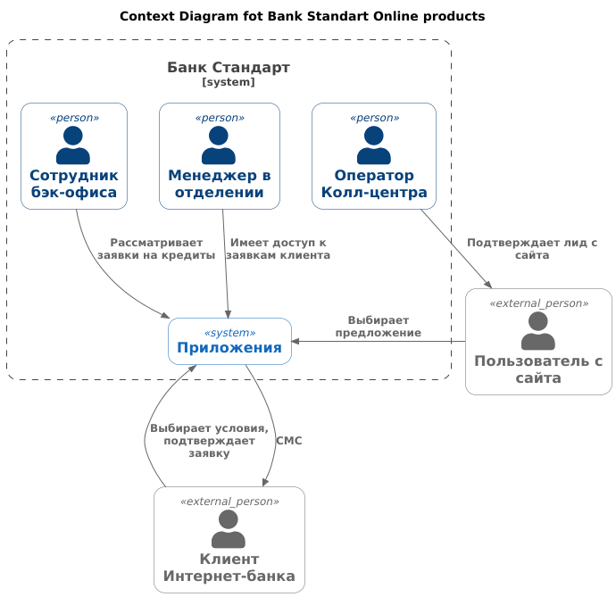
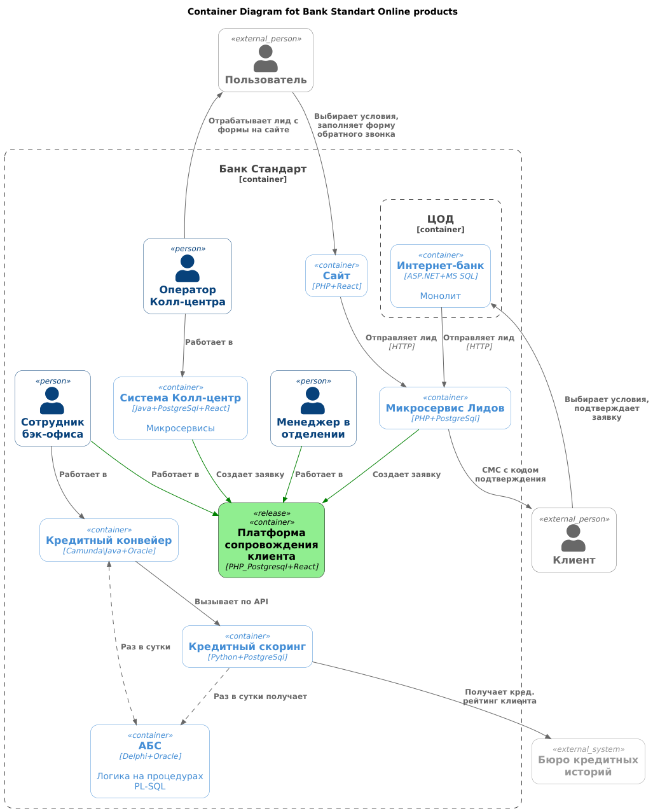

### **Название задачи:** 
Банк "Стандарт" - Оформление заявки на депозит онлайн
### **Автор:**
### **Дата:**
### **Функциональные требования**

**Лид** - не подтвержденная заявка с сайта или из Интернет-банка.

| **№** | **Действующие лица или системы**   | **Use Case**                         | **Описание**                                                                                                                                                                                                                                                                                                                                                                                      |
|:-----:|:-----------------------------------|:-------------------------------------|:--------------------------------------------------------------------------------------------------------------------------------------------------------------------------------------------------------------------------------------------------------------------------------------------------------------------------------------------------------------------------------------------------|
|  UC1  | Пользователь, менеджер колл-центра | Оформление депозита на сайте.        | 1. На сайте пользователь видит доступные депозиты с общиими ставками. 2. Пользователь заполняет форму обратного звонка с указанием телефона и ФИО и желаемого варианта депозита. 3. Менеджер колл-центра подтверждает лид по телефону и создает заявку на депозит.                                                                                                                        |
|  UC2  | Пользователь, менеджер фронт-офиса | Оформление депозита в отделении.     | 1. Менеджер проверяет клиента. 2. Если клиенту доступен депозит, то менеджер создает заявку. 3. Дальнейшее оформление депозита происходит без участи бэк-офиса.                                                                                                                                                                                                                           |
|  UC3  | Пользователь, Интернет-банк        | Оформление кредита в Интернет-банке. | 1. Пользователь видит предодобренные предложения, может сразу заполнить быструю заявку на кредит 2. Операция подтверждается смс-кодом. 3. Заявки по предодобренным предложениям проходят повторный скоринг по упрощенной процедуре.                                                                                                                                                       |
|  UC4  | Пользователь, менеджер фронт-офиса | Оформление кредита в отделении.      | 1. Менеджер проверяет, есть ли у клиента заявки по предодобренным предложениям. 2. Если есть, то менеджер работает по этой заявке. 3. Если нет - менеджер заводит новую.                                                                                                                                                                                                                  |
|  UC5  | Пользователь, сайт                 | Оформление кредита на сайте.         | 1. Пользователь видит на сайте общее предложение о кредите. 2. Клиент может подать заявку, оставив телефон и фио. 3. Также клиент может указать в заявке паспортные данные. 4. Если данных достаточно - заявка с сайта рассматривается в течение 1 дня. 5. Информирование осуществляется по смс - клиенту с сайта высылается решение и предлагается прийти в офис для оформления. |

### **Нефункциональные требования**
Опишите здесь нефункциональные требования и архитектурно значимые требования.

| **№** | **Требование**                                                                                                                                                                        |
|:-----:|:--------------------------------------------------------------------------------------------------------------------------------------------------------------------------------------|
|  1.   | Заявки на кредит по предодобренным предложениям должны быть исполнены в течение 1 дня.                                                                                                |     
|  2.   | Система кредитного скоринга очень важна для работы банка и испытывает повышенную нагрузку в рабочие часы, её не нужно нагружать дополнительными процессами по предрасчетам скорингов. |    

### **Решение**

В рамках реализации предлагается следующее:

| **Решение**                                                                     | **Обоснование**                                                                                                                                                                                                                                                                                         |
|---------------------------------------------------------------------------------|---------------------------------------------------------------------------------------------------------------------------------------------------------------------------------------------------------------------------------------------------------------------------------------------------------|
| Разработать внутренний продукт "Платформа сопровождения клиента"                | 1. Все заинтересованные сотрудники Банка могут получить доступ к ставкам и заявкам клиента. 2. Заявки полностью вынесены из АБС => могут быть масштабированы при необходимости. 3. Аутентификация и авторизация для сотрудников Банка. 4. Платформа может быть расширена новыми продуктами. |
| Обращения через сайт подтверждаются обратным звонком.                           |                                                                                                                                                                                                                                                                                                         |
| Заявки имеют приоритеты.                                                        | Приоритет имеют заявки на кредиты попредодобренным предложениям, а также заявки с сайта с полными данными.                                                                                                                                                                                              |
| Реализовать Скоринг на лету.                                                    | В прошлой итерации система Скоринга отмасштабирована, может выдержать нагрузку.                                                                                                                                                                                                                         |
| Вернуться к вопросу целесообразности проливки платежей в Скоринг через очереди. | Вместо 1 раза в сутки.                                                                                                                                                                                                                                                                                  |
| Вернуться к вопросу модернизации Интернет-банка.                                | Ранее были нарекания по быстродействию. Возможно, пришло время реализовать собственное решение.                                                                                                                                                                                                         |

[Diagram_context](https://www.plantuml.com/plantuml/uml/XLDTIzjW6BtFhtZjpLgmBGEl1hkOsdr0PqKhubL8qwXXQHAIDqmP0zlARjoGxKh6sDP_KAMjcVtw2y_xZtQUf5fNXPNI94-VSvvppljaQQEqgw-jwDlLlNBf-LDjoNPD9wfRKU28Godzy5cn61Zl2mUsF8ngKMW5fkTAovK5qsiKVSTmPTHmyg6iEtQjkBQIt-JIpjjoiM64qWfGqjSOSIGBFZerxKdvnLvbfwgNIo-h-jQRLw-hsPmsgrKhc_fwPNS35KtQqh7432lMRUCWC1fYtvDYrN3VYMrfk7KZaABYEhPh2J_mwf4fGqtRj8BGS_NIaSootcMHeLyqeQ7wJDUuNb5NjQZFpq8ryQKk_K6bcq5d9dSVRZesd3B1TnfI3D1OjGHTy8NwweJ6-6tbwH8KOxgvez2sZ-6zeQzw4MiypjQWc6c-fes2EZmGjps8EL6jJ4vyq0G-AJ1h-BvZcuQqFJTCz6DM30aJ6h08YjNvR1I3KiLPpxS2Gtg9uPyqJGIorOaw4J2016YOLvzI5_pVGuhzm4lz_aZ6zA5lm3o2hWHuMdX6SAa4YX_YQuQP-EnmCuor0U1MEBvKN-WcZ_efr3VdKJ5wot9kHoywlw0HnlKvzXx0JT2sQIgOyHhkpd6So9r6gCoF2EovE-9KqoBlRu2Rq37YY99qiHVfd3blBA2-2seqS1OnMiz0_L7Jc3dThaNcR-eC2n5pm2dVT8Q-TtpKdzbdcjij-n-HQaFlCDbWdFyoY77VWzkhvAW7l4mB3bJxDcOUD5-G--_5emmSPU_HruE9_bKwVqiws9iEJ_iB)

[Diagram_container](https://www.plantuml.com/plantuml/uml/hLPTJnj757tVNp6na6841bNAKoKUm3WXbODTsn6AL6arNW_sAkjTTtUS1bMH26wQ1zgchVfGDH6Kb_OL73is9ZX_OVOVzTwPzRAxjY5I0O6zipFdddlkrzpPpktesNjwkV8adrlxGhjZseRLhh6sQv46votlozLLbtwtKZTverrjUymr79ipcwyOJdErPL6RjvjMnkCrowokPkzbYhZq-55-jKazpbnOqhDmWfesSrTQi5VJxkRNdnGUL_Hyxdv5Bpryi5L9Bsh1MgLGr3SBEzkmegtNQZcBDS5OXTRJAPTPZ7eijKmMglMiOpdkMgfgKUCfhko2ZM3DCkiD_i1bp4uj8aQ9MV8yzVPi0_TozZpOkx1UAXLszFk5xOgUBUGB9NXh0TFOs-YBCj-psDeczHgibeVdz6BCH41HXyzK32fL3_XetEGM8w4aPDEaTPSsoQx3oGQrdv8oftQDkfmKR3nFMgvJQnlSqxGYSpt7rdFFUHe3iKnIubYCnON_anZ0PrUS-WUYZyzWF0N68WSComGTySXVua8COTkbVn1iA-z1f9fgcyjg9jUhRPVHDkx-pV_5tnTZ8aRmqHSzCGGRb_wX_uh0rvVmC8ONGt6EleLUwHjE6vtOIrV19OaZJiMb615n0aVmQm_OxWE5HVAzHk17SKqxBUPIxaZdZiGdqGVqKsM507NmLbna_1yLVtmN-121s7M1Xkxixfe6GvXtk5bo_u1mH7G9m1t0CsWbtmt5S1gc2faLGJd1Cy2u0-Vm1BXovlyiHXbO_m6bY56PeKIDSgf3C0tTW4YeyFq3FluHIX0xc3PnayqW6864VwBBKX3mnZ_8Y3EbAPfTBnTNjdELfKTbKluwdr9kZ-4j2ZP4cQM55t5oQS_aWNEdubpbGt6hk5HYrE2pl4dJgeVxVuLudk26JMQr6kPImQM6nQJPjs3oFUeZJWdOXt-VC85ao7f-HuRp5IdcCyWp2H-adoSJKYPhFEl4EIIYzAiBo-Se1XhDqYQA_CrNz1cDS9c2zmp7DUtwjVWGo56GqvVYlLHaZpSSUwdeU1ogkFojDHFRe9OLYUn9K1rzyH4rcCvS195yht2lT8VW3MN5ZO4EHhmhuGwno19cPLthrFDC3ng7mIBE7OD9g1r8J_G7UG3QMCK34CTG3psL__uRr3Ni2ogL8HFqW9mN8RV0QTrR2xjnm6Z3X1wOZ5-GBNz3TWsmxC253g2FPBa5EAehApKH8XcZ-HYGMRBxTVpNyB8lqtSEQ8BNT1xy3h4Vm5zN8KbeibvyE74FGQvQKoBMoErCjfJWS3TYEjP6helM39Ias7Akp8DEbiwrhE8zydPeQNVZgPa2jPZUD0tNWMdr32pDJ-t9NC2i74tQKAJYajMM0iCrxxF1ty9o3vD-9dIeoZJezTh0J839svieCu1gUmCcHtxdfj35CkXsJQWmo59ItNrs6FwLFK_1oaw5uikg6ee1xjYgL8e05w8bvz4jmSPhQKvOZsNB6iZonE4RbYcsh9v_2AR8fCt1avmxE95ng8b-nAoMq6QElICuXcqIoL-0u5Us8bZpXFa_cA4iK-h2ddZR2eN1kOfJzINylaRv8tqi6e9WRBtGD3IWRf2J2m3slpCukpyvrm7vBkIOWE6mB1DFjLkO3ufxg7S7hbDm5rBtj4iv_iT41Wi7zIYy5ybe1zVGgSlDZGJGU0yCT6LTVvXN4cX8YtVhoLtvI5qOyTeKqqW5uUOK2boOtoHKlRuJ9uWbxodOSpxEuXvCtG0oEO-cRk77yK4NtiPNYFn4YlAwafpYeCL_)

### **Альтернативы**
Опишите здесь наиболее важные альтернативные решения.

1) Если система Колл-центра не поддерживает возможность обратного звонка "из коробки", то нужно ее дорабатывать, чтобы заявки с сайта могли прозваниваться оператором.
2) Возможно коробочная система Колл-центра уже имеет модуль, аналогичный продукту "Платформа сопровождения клиента" по функционалу. Минус: зависимость от интегратора.

**Недостатки, ограничения, риски**

| **№** | **Недостатки**                                             | **Комментарий** |
|:-----:|:-----------------------------------------------------------|:----------------|
|  1.   | Возможно, нужно наращивать штат разработчиков, devops.     |                 |
|  2.   | Может потребоваться наращивание мощностей, инфраструктуры. |                 |
| 3. | Потребуется масштабная миграция исторических данных заявок пользователей из БД АБС |                 |

